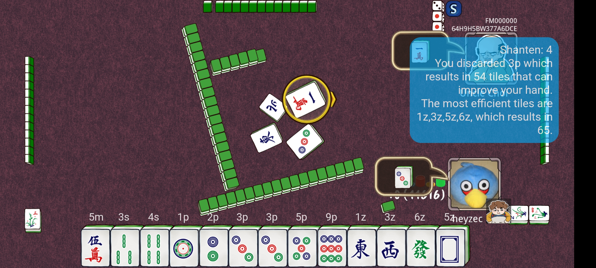

# TileTrainer

TileTrainer is designed to enhance your [Let's Mahjong](https://play.google.com/store/apps/details?id=com.gdapp.mjlafree&hl=en&gl=US) gameplay experience by providing real-time insights into strategic tile discards.


_Screenshot: Analysis shown while playing a match in Let's Mahjong_

It is inspired by [Euophrys's Mahjong Efficiency Trainer](https://euophrys.itch.io/mahjong-efficiency-trainer).


## Features

- **Optimized Gameplay:** Evaluate the strategic value (ukeire) of each tile discard to enhance your decision-making during Mahjong games.

- **Machine Learning Techniques:** Experimented with and implemented various machine learning techniques to locate, detect, and classify on-screen Mahjong tiles.


## Technologies Used

- **Flutter**: For creating the app user interface, including the overlay layer for the commentary.
- **Python via [Chaquopy](https://chaquo.com/chaquopy/)**: The processing of each frame of the screen recording is done on-device in Python.
- **OpenCV**: For detection and classification of mahjong tiles on screen.

In Mahjong, a hand is made up of 13 tiles (or 14 when choosing to discard), with 34 different types of tiles.

To locate all the tiles, OpenCV's `findContours` function is used. By applying a probabilistic [Hough Line Transform](https://docs.opencv.org/3.4/d9/db0/tutorial_hough_lines.html) on the centers of all the contours,
we can detect contours that are lined up in a straight line, which is likely to be the player's hand.

In order to classify each tile, I initially tried to use a [SIFT](https://www.wikipedia.com/en/Scale-invariant_feature_transform) (Scale-Invariant Feature Transform) detector. However, as there are many repeating patterns
among the tiles (especially within each suit of tiles), the app kept classifying tiles wrongly. I eventually settled on template matching,
where for each of the 34 tiles a template is taken by manually cropping images of the in-app tiles.

In the future, I would like to explore using few-shot learning and Siamese neural networks.


## Mahjong Glossary
|Term|Explaination|
|---|---|
|[Ukeire](https://riichi.wiki/Ukeire)|Also known as tile acceptance, it is the number of tiles that the current hand can accept to improve it (which increases shanten). This is what the app is training the user. (larger is better)|
|[Shanten](https://riichi.wiki/Shanten)|The number of tiles to attain tenpai. Any discard made by the user that increases shanten will be flagged out by the app. (smaller is better)
|[Tenpai](https://riichi.wiki/Tenpai)|When the hand is ready, i.e. requires only one tile to complete the hand|
|MPSZ notation|A shorthand used to describe tiles, e.g. `4788m12446s34p26z`. See this reddit post for more infomation: [Link](https://www.reddit.com/r/Mahjong/comments/dgth5z/is_there_a_standard_notation_for_tiles/)|


## Try it out!

1. Install the Let's Mahjong app on the Google Play store: [Link](https://play.google.com/store/apps/details?id=com.gdapp.mjlafree&hl=en&gl=US)

1. Install TileTrainer. You can get the apk from the Releases page.

1. Open TileTrainer. Click on "Grant permissions" to allow showing of notifications. This is because Android requires foreground services to show a persistent notification. (The foreground service is needed for the app to record the screen.)

1. Ensure phone is in landscape mode first, then click "Start Streaming". Grant permission for the app to record the sceeen.

1. Open the Let's Mahjong app and start any game of Mahjong. A quick way is to click Start -> Freeplay -> to play an offline game.

1. Play the game as per normal. On every discard, commentary about your choice of discard will be shown on the top right of the screen.

_Happy gaming and strategic tile discarding!_


## Compiling instructions

1. Ensure the following build requirements are present. Users of the [Nix package manager](https://www.wikipedia.com/en/Nix_(package_manager)) can run the one-liner `nix develop` to install these requirements.
    - Flutter
    - Android SDK
    - Python

1.  Download required Flutter dependencies:
    ```
    dart pub get
    ```

1. Compile!
    ```
    flutter build apk --debug
    ```
    The resulting apk will be found under the `build/app/outputs/apk/` folder.

